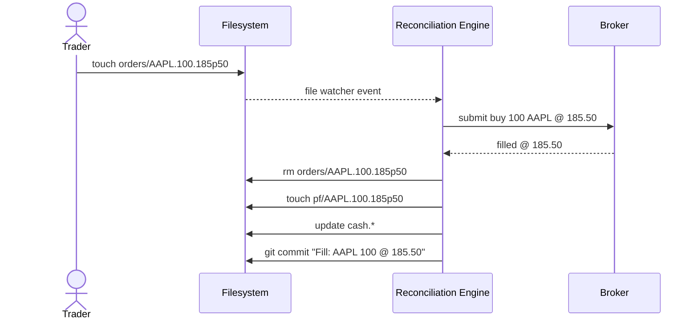
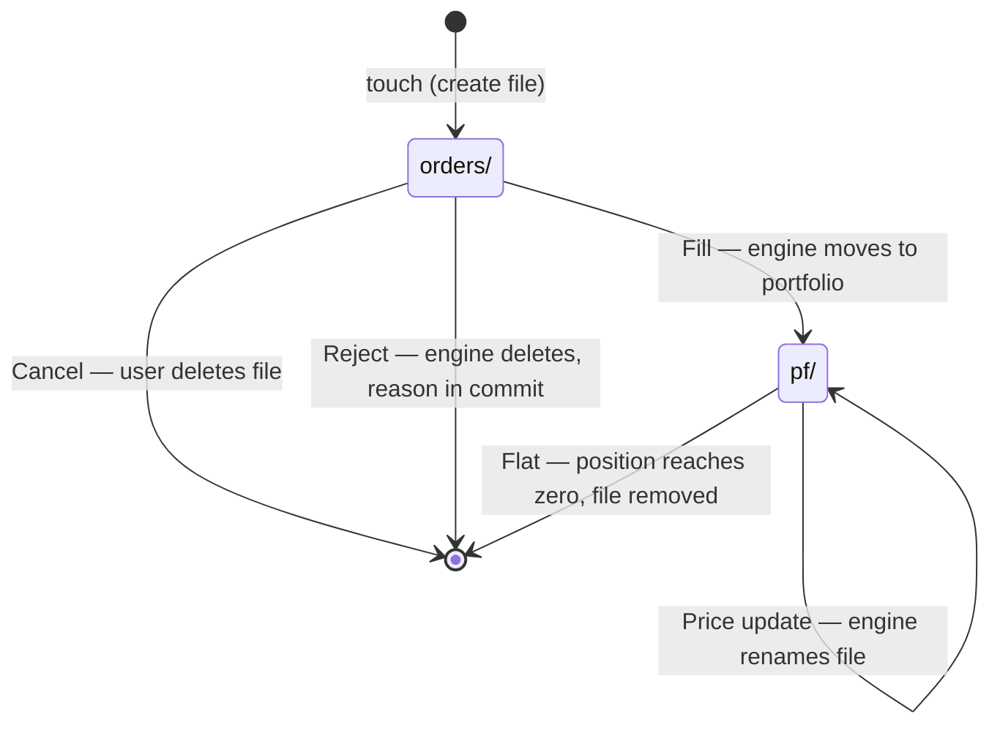
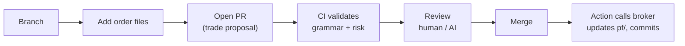
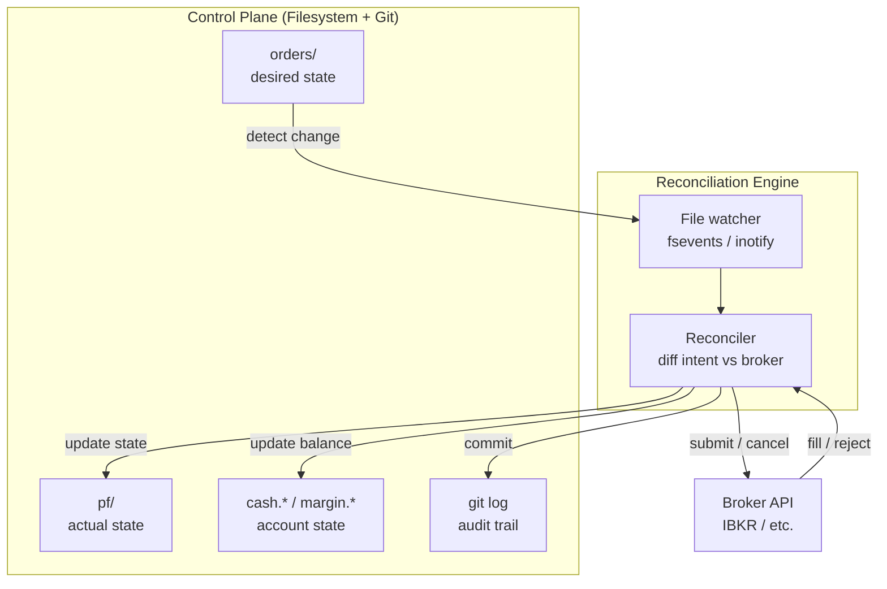

# Trading as File System (TaFS)

*`ls` is your query. `touch` is your API. `rm` is your cancel.
Standard Unix tools are the client.*

TaFS is an experimental architecture that maps trading intent,
position state, and account state directly onto a filesystem.

Instead of imperative API calls, TaFS treats trading as a **declarative
desired-state system**.

- **File = order**: `touch AAPL.100.185p50` to place, `rm` to cancel. No special tools needed
- **Directory structure is the data**: no YAML, no JSON. Filenames and directories are everything
- **ls is your order book, git log is your trade history**: existing Unix commands become trading tools
- **Git manages all history automatically**: full audit trail, rollback with `git revert`
- **Branches = trading modes**: `main` = live, `paper` = simulation. Same structure, different branches
- **OS permissions = access control**: traders can only write orders, only the engine updates positions. No custom auth
- **SSH to trade from anywhere**: connect to the server and `touch` a file
- **GitHub Actions becomes the execution engine**: PR = trade proposal, merge = execute, CI = risk check
- **Entire existing infrastructure works**: rsync, cron, Docker, Make, tmux... any tool that handles files is a trading tool
- **Nothing new invented**: POSIX + Git + GitHub. Battle-tested primitives, composed

------------------------------------------------------------------------

## Quick Example

    /tradefs/ibkr
      spot/
        orders/
          AAPL.100.185p50
        pf/
          AAPL.200.182p30
        cash.50000

      margin/
        orders/
          TSLA.-50.248p00.o
        pf/
          TSLA.-50.245p60
        marginfree.30000

-   Creating files expresses **intent**
-   File presence expresses **state**
-   Rename/delete expresses **lifecycle**
-   A reconciliation engine converges broker reality toward filesystem
    state

------------------------------------------------------------------------

# 6H1W

## What

A filesystem-native declarative trading control plane.

## Why

-   eliminate SDK/API coupling
-   maximize auditability
-   unify strategy, execution, and state
-   enable AI-native automation
-   leverage OS primitives (atomic rename, permissions, watchers)

## Who

-   discretionary traders
-   quant developers
-   infra engineers
-   AI trading agents

## When

Most useful in semi-systematic discretionary trading and personal
trading infrastructure.

## Where

Local machine, VPS, network FS, or FUSE virtual filesystem.

## How

A reconciliation engine monitors filesystem changes and synchronizes
broker state accordingly.

## How Much

Minimal: POSIX filesystem + watcher + execution engine.

------------------------------------------------------------------------

# Design Philosophy

## Declarative Trading

Orders describe **desired exposure** instead of imperative actions.

## Filesystem as Control Plane

Filesystem becomes the single source of truth for intent and state.

## Separation of Intent and State

    orders/ = desired
    pf/     = actual
    git log = history

## Idempotency

Repeated reconciliation produces identical results.

## Unix-native Semantics

-   create → submit
-   delete → cancel
-   rename → state transition
-   commit → checkpoint

------------------------------------------------------------------------

# Filename Grammar

## Orders

    <code>.<signed_lot>[.<price>][.<suffix>]

-   signed lot represents target exposure
-   `p` used for decimal prices
-   suffix: `o` open, `c` close (margin), `stp` stop

## Positions

    <code>.<signed_lot>.<avg_price>

-   positive = long
-   negative = short
-   zero → file removed

## Account State

    cash.1200000
    marginfree.900000
    equity.2300000

------------------------------------------------------------------------

# Advanced Orders

A file is an atomic order. A directory is a compound order.

## Stop

    orders/AAPL.100.175p00.stp

Same grammar as basic orders — type expressed as a suffix, consistent
with margin mode (`.o`, `.c`).

## OCO (One Cancels Other)

    orders/AAPL.oco/
      -100.195p00
      -100.175p00.stp

The directory name carries the instrument code. Children inherit it
and only specify what differs: lot, price, and type.

When one leg fills, the reconciliation engine cancels the other.

## IFDOCO (If Done, One Cancels Other)

    orders/AAPL.ifdoco/
      100.185p50/
        -100.195p00
        -100.175p00.stp

The IF-leg (`100.185p50/`) is a directory because it has dependents.
When it fills, its children activate as an OCO group.

Nesting depth = dependency depth. No sequence prefixes needed.

## Key Properties

-   **Code appears once** — the group directory scopes the instrument;
    children inherit it
-   **Nesting = dependency** — children activate when their parent fills;
    the filesystem tree *is* the execution graph
-   **Type as suffix** — `.stp`, `.o`, `.c` follow the same convention;
    no price = market, plain price = limit
-   **File = atomic order, directory = compound order** — one rule,
    no special cases

------------------------------------------------------------------------

# Order Lifecycle

The existing primitives already cover the full lifecycle — no
additional directories needed.

| Event    | Filesystem effect                                     |
|----------|-------------------------------------------------------|
| Submit   | file created in `orders/`                             |
| Fill     | file removed from `orders/`, `pf/` updated           |
| Cancel   | user deletes file from `orders/`                      |
| Reject   | engine deletes file from `orders/`, reason in commit message |

`orders/` is pure intent. `pf/` is pure state. `git log` is history.
The directory tree only reflects what is true right now.

Per-order risk management is expressed through compound orders — an
IFDOCO is a risk-managed position (entry with profit target and stop
loss built in).

------------------------------------------------------------------------

# Primitives

TaFS does not invent new infrastructure. It maps trading onto
primitives that already exist in POSIX filesystems and Git.

## Filesystem

| Primitive | Trading use |
|---|---|
| File create/delete | order submit / cancel |
| Atomic rename (`mv`) | state transition without race conditions |
| Directories | namespaces (broker, asset class) and compound orders |
| Nesting | dependency between order legs |
| Permissions (`chmod 444`) | lock an order — prevent accidental cancel |
| Timestamps (`mtime`) | submission time, last update — free metadata |
| Symlinks | aliases, cross-references between orders and positions |
| Extended attributes (`xattr`) | hidden metadata (broker order ID, notes) |
| File watchers (`fsevents`/`inotify`) | reconciliation engine trigger |
| File content | optional annotation (filename is identity, content is metadata) |
| Dotfiles | config and metadata that don't affect trading state |
| Mount points | different brokers as different mounts |

## Git

The TaFS directory is a Git repository. Git replaces custom logging
and provides audit, branching, and time-travel for free.

| Primitive | Trading use |
|---|---|
| Commits | reconciliation checkpoints — atomic state snapshots |
| Commit messages | event descriptions (fill, rejection reason) |
| `git log` | full audit trail — replaces `.log/` |
| `git diff` | what changed between any two points |
| `git blame` | what created or modified each order |
| `git revert` | undo a specific change |
| `git bisect` | find when something went wrong |
| **Branches** | `main` = live, `paper` = simulation, `backtest/2024q1` = replay |
| Tags | milestones — end of trading day, strategy change points |
| Hooks | `pre-commit` validates order grammar, `post-commit` triggers engine |
| Worktrees | multiple strategies running in parallel from one repo |

Branches are especially powerful: paper trading, backtesting, and live
trading are the same spec, same directory structure, different branches.
`git diff main..paper` compares simulated vs live portfolio.

------------------------------------------------------------------------

# Permissions as Authorization

Filesystem permissions map directly to trading roles. No custom
auth system needed — the OS enforces access control.

## Role separation

| Role | `orders/` | `pf/` | account state |
|---|---|---|---|
| Trader (human/AI) | `rwx` place/cancel | `r-x` view | `r--` view |
| Engine (reconciler) | `r-x` read/act | `rwx` update | `rw-` update |
| Viewer (dashboard) | `r-x` read | `r-x` read | `r--` read |

Humans write to `orders/`. Only the engine writes to `pf/`.
Enforced by the OS, not application code.

## Useful primitives

-   **Sticky bit** on `orders/` — only the creator of an order can
    cancel it (same mechanism as `/tmp`)
-   **chmod 444** on an order file — locked, cannot be canceled
-   **chattr +i** — immutable flag for regulatory holds
-   **Unix groups** — per-broker isolation, team access control
-   **Engine as system user** — reconciler runs as `tafs-engine`,
    like `nginx` or `postgres`

------------------------------------------------------------------------

# GitHub as Platform

When a TaFS repository is hosted on GitHub, the trading workflow
maps onto GitHub's native features.

## Workflow

    1. Branch    → create feature branch
    2. Orders    → add/modify order files
    3. PR        → trade proposal (diff = proposed trades)
    4. CI        → Actions validate grammar, check risk
    5. Review    → human or AI approves the trades
    6. Merge     → triggers reconciliation Action
    7. Sync      → Action calls broker, commits updated pf/

A pull request *is* a trade proposal. The diff *is* the order book
change. Code review *is* trade review.

## Feature mapping

| GitHub feature | Trading use |
|---|---|
| **Secrets** | broker API keys, per-environment credentials |
| **Environments** | `production` = live broker, `paper` = simulation |
| **Environment protection** | require approval before live trades execute |
| **Actions (on push)** | reconciliation engine — merge triggers execution |
| **Actions (scheduled)** | periodic sync of broker state back to `pf/` |
| **Actions (CI)** | validate filename grammar, check risk limits |
| **Branch protection** | require PR review before orders go live on `main` |
| **Branches** | `main` = live, `paper` = simulation, feature branches = trade proposals |
| **PR diff** | visual diff of proposed portfolio changes |
| **PR comments** | discussion and rationale for trades |
| **CODEOWNERS** | risk manager must approve certain instruments or lot sizes |

## Environments as trading modes

    production  → real broker, real money (Secrets: live API keys)
    paper       → simulated fills, no real execution
    backtest    → replay historical data against order files

GitHub environment protection rules enforce that production trades
require manual approval — risk management via platform, not code.

------------------------------------------------------------------------

# Unix Ecosystem as Toolchain

Because the interface is the filesystem, every tool that works with
files becomes a trading tool. TaFS does not need a CLI, a dashboard,
or a client library — they already exist.

## Remote access

| Tool | Trading use |
|---|---|
| **SSH** | place an order from anywhere: `ssh server 'touch tradefs/spot/orders/AAPL.100.185p50'` |
| **SSHFS** | mount remote TaFS locally — laptop is a thin client, engine runs on server |
| **NFS** | multiple traders on a LAN share one TaFS instance |
| **SSH ForceCommand** | restrict users to file operations inside `/tradefs/` only |

SSH key = trader identity. Authentication, authorization, and
encryption in one tool.

## Replication

| Tool | Trading use |
|---|---|
| **rsync** | incremental sync between machines — disaster recovery, multi-site |
| **rsync + cron** | periodic state replication without a daemon |
| **scp** | copy a portfolio snapshot to another machine |

## Scheduling

| Tool | Trading use |
|---|---|
| **cron** | scheduled reconciliation, end-of-day commits |
| **systemd timer** | same, with logging and failure recovery |
| **systemd service** | engine as a managed daemon with watchdog and auto-restart |

## Security

| Tool | Trading use |
|---|---|
| **GPG** | sign git commits — non-repudiation, verified audit trail |
| **SSH keys** | trader identity — who connected = who traded |
| **chroot** | restrict the engine to only see `/tradefs/` |

## Composition

Standard Unix tools compose directly with TaFS:

    ls orders/                        # list active orders
    ls pf/                            # list positions
    ls orders/ | wc -l                # count active orders
    find orders/ -name "AAPL.*"       # find all Apple orders
    watch -n1 ls pf/                  # live position dashboard
    diff <(ls pf/) <(ls orders/)     # compare intent vs state

A Makefile becomes a trading CLI:

    buy:
        touch orders/$(TICKER).$(LOT).$(PRICE)
    cancel:
        rm orders/$(TICKER).*

    $ make buy TICKER=AAPL LOT=100 PRICE=185p50

A tmux session becomes a trading terminal:

    ┌──────────────────┬──────────────────┐
    │ watch ls orders/  │ watch ls pf/     │
    ├──────────────────┼──────────────────┤
    │ git log --oneline │ tail engine.log  │
    └──────────────────┴──────────────────┘

## Containers

| Tool | Trading use |
|---|---|
| **Docker** | containerize the engine, mount TaFS as a volume |
| **Docker Compose** | engine + broker adapters as services, shared volume |

## Archival

| Tool | Trading use |
|---|---|
| **zip/tar** | snapshot a portfolio and share it |
| **git bundle** | full repo + history as a single file |

------------------------------------------------------------------------

# Architecture

------------------------------------------------------------------------

# Scope

TaFS is a **filesystem representation spec** — it defines how trading
intent and state map onto files and directories.

What belongs in the filesystem (this spec):

-   order intent (`orders/`)
-   position state (`pf/`)
-   account state (`cash.*`, `marginfree.*`, `equity.*`)
-   history (`git log`)

What belongs in the engine (implementation concern):

-   risk limits (max exposure, daily loss caps)
-   execution policies (TWAP, VWAP, slicing)
-   broker configuration and credentials
-   drift detection and error recovery

What can be built on top (higher-level abstractions):

-   target allocation (desired portfolio → engine generates orders)
-   watchlists and alerts
-   signal ingestion from external systems
-   AI-native controllers

------------------------------------------------------------------------

# Prior Art

TaFS combines ideas from systems that use filesystem structure as a
data model with the declarative reconciliation pattern from
infrastructure-as-code. No existing system combines all three; no
trading system uses this pattern.

| System | What TaFS borrows |
|---|---|
| **cgroupfs** | `mkdir` creates a resource, `rmdir` destroys it — directory existence *is* the operation |
| **Maildir** | one file = one message, filename = metadata, moving between directories = state transition |
| **Plan 9 / 9P** | every resource has a filesystem interface — the structure is the schema |
| **GitOps** | Git as single source of truth, continuous reconciliation toward desired state |
| **Terraform** | declarative desired-state with explicit diff and apply |

Where TaFS differs: Terraform and GitOps store data *in* file content
(YAML, HCL). TaFS stores data *in* the filesystem structure itself —
filenames, directories, presence, and absence. The filesystem is not
a container for configuration; it is the configuration.

------------------------------------------------------------------------

# Benefits

-   deterministic audit trail
-   simple mental model
-   OS-level reliability primitives
-   AI-agent friendly interface
-   reproducibility
-   declarative automation

------------------------------------------------------------------------

# Trade-offs

-   reconciliation complexity
-   drift detection required
-   compound orders need nesting
-   not suited for HFT

------------------------------------------------------------------------

# Future Directions

-   FUSE virtual trading filesystem
-   multi-broker reconciliation
-   AI-native controllers
-   target allocation layer (declare desired portfolio, engine converges)

------------------------------------------------------------------------

# Status

Early experimental concept.
